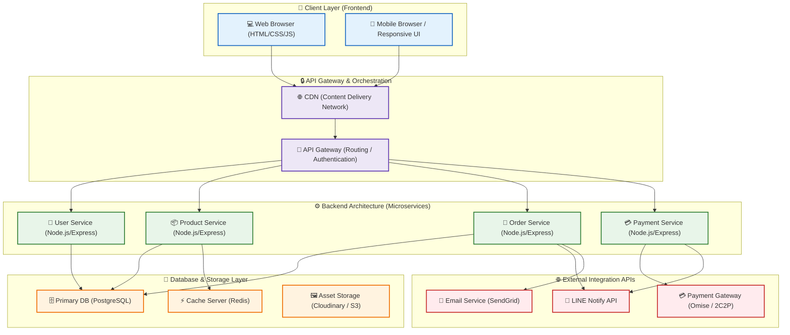
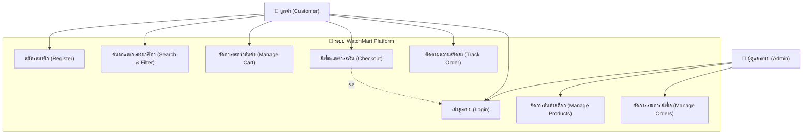
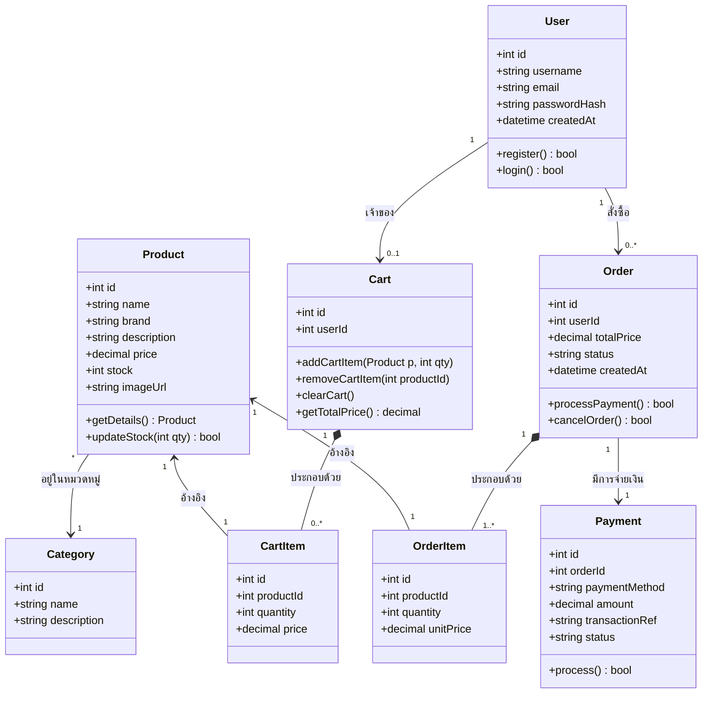
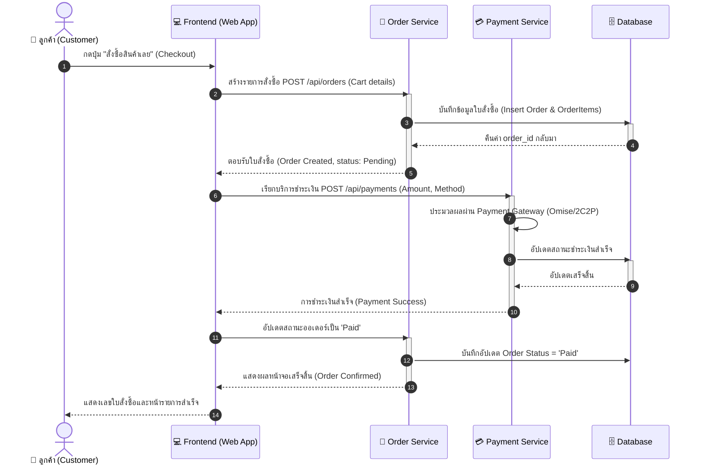
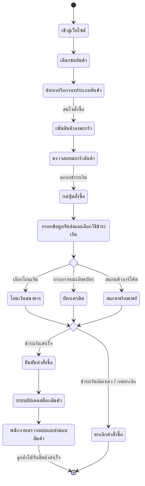

# 📄 เอกสารการวิเคราะห์และออกแบบระบบ (System Analysis & Design)
## โครงการ: WatchMart - แพลตฟอร์มร้านขายนาฬิกาพรีเมียมออนไลน์
**วิชา: CSI204 ดิจิทัลแพลตฟอร์มสำหรับพัฒนาซอฟต์แวร์ (SPU SIT)**

---

## 1. การวิเคราะห์ความต้องการของระบบ (System Requirements)
แพลตฟอร์ม **WatchMart** พัฒนาขึ้นเพื่อรองรับพฤติกรรมการซื้อนาฬิกาผ่านทางออนไลน์ โดยระบบแบ่งความต้องการออกเป็น 2 ส่วนหลัก:

### 1.1 ความต้องการเชิงฟังก์ชัน (Functional Requirements)
- **ระบบสำหรับผู้ใช้ทั่วไป (Customer Front-end)**:
  - การลงทะเบียนและเข้าสู่ระบบ (Register / Login)
  - การเลือกชมและค้นหานาฬิกาตามประเภท แบรนด์ หรือช่วงราคา (Product Browsing & Filtering)
  - ระบบตะกร้าสินค้า (Shopping Cart) เพิ่ม/ลดจำนวนสินค้า
  - ระบบสั่งซื้อสินค้าและการชำระเงิน (Checkout & Payment Integration)
  - การติดตามสถานะคำสั่งซื้อ (Order Tracking)
- **ระบบแจ้งเตือนภายนอก (Integration Notification)**:
  - แจ้งเตือนยอดคำสั่งซื้อและการชำระเงินผ่าน LINE Notify
- **ระบบสำหรับผู้ดูแลระบบ (Admin Dashboard)**:
  - จัดการข้อมูลนาฬิกาและสต็อกสินค้า (CRUD Products)
  - ตรวจสอบรายการคำสั่งซื้อและการจัดการสถานะการจัดส่ง (Order Management)

### 1.2 ความต้องการที่มิใช่เชิงฟังก์ชัน (Non-Functional Requirements)
- **Security**: การรักษาความปลอดภัยข้อมูลผู้ใช้ รหัสผ่านต้องถูกแฮชก่อนบันทึก (เช่น bcrypt) และใช้ Token-based Authentication (JWT)
- **Performance**: โหลดหน้าเว็บได้รวดเร็ว (ต่ำกว่า 2 วินาที) โดยมีระบบ Cache สำหรับข้อมูลรายการนาฬิกาที่เข้าถึงบ่อย
- **Scalability**: ระบบสถาปัตยกรรมต้องแยกส่วนกัน (Microservices) เพื่อให้รองรับการขยายตัวเมื่อมีผู้ใช้งานพร้อมกันจำนวนมากในอนาคต
- **Responsiveness**: หน้าเว็บแสดงผลได้ดีทั้งบนหน้าจอคอมพิวเตอร์ แท็บเล็ต และมือถือ (Mobile-First Design)

---

## 2. การออกแบบสถาปัตยกรรมระบบ (System Architecture)
ระบบถูกออกแบบโดยยึดตามหลักการ **Separation of Concerns (SoC)** และสถาปัตยกรรม **Microservices** เพื่อการพัฒนาที่ยืดหยุ่นและรองรับปริมาณธุรกรรมที่สูง

### 2.1 แผนผังสถาปัตยกรรมระบบ (Mermaid Diagram)



---

## 3. การออกแบบตามหลักการวิศวกรรมซอฟต์แวร์ (Software Engineering Principles)

### 3.1 Separation of Concerns (SoC) & Modularity
หน้าบ้าน (Frontend) พัฒนาแยกจากหลังบ้าน (Backend) อย่างชัดเจน โดยติดต่อผ่าน RESTful API:
- **Frontend Layer**: ดูแลเฉพาะการจัดแสดงผลอินเทอร์เฟซและการโต้ตอบของผู้ใช้งาน (HTML/CSS/JS)
- **Backend Services**: มีการแบ่งแยกฟังก์ชันการทำงานย่อย (Services) ดังนี้:
  - `User Service`: จัดการข้อมูลผู้ใช้และการพิสูจน์ตัวตน
  - `Product Service`: ดึงข้อมูลนาฬิกา ค้นหา และอัปเดตสต็อกสินค้า
  - `Order Service`: จัดการตะกร้าสินค้า สร้างคำสั่งซื้อ และเปลี่ยนสถานะคำสั่งซื้อ

### 3.2 Single Responsibility Principle (SRP)
ทุก Service และทุก Class ถูกออกแบบมาเพื่อทำหน้าที่เพียงอย่างเดียวเท่านั้น เช่น ในโค้ดตัวอย่างหลังบ้าน:
- `user-service/server.js` จัดการเฉพาะ API การล็อกอินและการดึงโปรไฟล์ผู้ใช้
- `product-service/server.js` จัดการเฉพาะข้อมูลสินค้า

### 3.3 Loose Coupling & Flexibility
การเชื่อมต่อระหว่างระบบใช้มาตรฐานการแลกเปลี่ยนข้อมูลเป็น JSON ผ่าน HTTP REST APIs ทำให้แต่ละ Service ทำงานเป็นอิสระต่อกัน (Decoupled) หากเราต้องการเปลี่ยนฐานข้อมูลหรือเปลี่ยนภาษาโปรแกรมของ `Payment Service` ก็สามารถทำได้โดยไม่กระทบกับบริการอื่น

### 3.4 Performance Optimization ด้วย Caching
ข้อมูลประเภทนาฬิกาที่มีการเรียกชมบ่อยครั้ง (เช่น สินค้าขายดี หรือสินค้ารายการใหม่) แต่ไม่ได้เปลี่ยนแปลงบ่อย จะถูกเก็บไว้ใน **Redis Cache** เพื่อลดความถี่ในการ Query ไปยังฐานข้อมูลหลัก ทำให้ระบบสามารถส่งกลับข้อมูลให้ลูกค้าได้เร็วกว่าเดิมถึง 10 เท่า

---

## 4. โครงสร้างฐานข้อมูล (Database Schema Design)
เราเลือกใช้ **PostgreSQL** เป็นฐานข้อมูลหลักสำหรับการทำธุรกรรม เพื่อรักษาเสถียรภาพความถูกต้องของข้อมูล (ACID Properties)

### 4.1 ตาราง Users
```sql
CREATE TABLE users (
    id SERIAL PRIMARY KEY,
    username VARCHAR(50) UNIQUE NOT NULL,
    email VARCHAR(100) UNIQUE NOT NULL,
    password_hash VARCHAR(255) NOT NULL,
    created_at TIMESTAMP DEFAULT CURRENT_TIMESTAMP
);
```

### 4.2 ตาราง Products
```sql
CREATE TABLE products (
    id SERIAL PRIMARY KEY,
    name VARCHAR(100) NOT NULL,
    brand VARCHAR(50) NOT NULL,
    description TEXT,
    price DECIMAL(10, 2) NOT NULL,
    stock INT NOT NULL DEFAULT 0,
    image_url VARCHAR(255),
    created_at TIMESTAMP DEFAULT CURRENT_TIMESTAMP
);
```

### 4.3 ตาราง Orders
```sql
CREATE TABLE orders (
    id SERIAL PRIMARY KEY,
    user_id INT REFERENCES users(id),
    total_price DECIMAL(10, 2) NOT NULL,
    status VARCHAR(20) DEFAULT 'Pending', -- Pending, Paid, Shipped, Cancelled
    created_at TIMESTAMP DEFAULT CURRENT_TIMESTAMP
);

---

## 5. การวิเคราะห์และออกแบบระบบด้วย UML Diagram (UML Design)
เพื่อแสดงโครงสร้าง ลำดับการทำงาน และความสัมพันธ์ของระบบ **WatchMart** ให้ชัดเจนยิ่งขึ้นตามแนวทางวิศวกรรมซอฟต์แวร์

### 5.1 Use Case Diagram (แผนภาพแสดงการทำงานของผู้ใช้)
แผนภาพ Use Case แสดงขอบเขตของระบบ (System Boundary) และปฏิสัมพันธ์ระหว่างนักช้อป (Customer) และผู้ควบคุมระบบ (Admin)



### 5.2 Class Diagram (แผนภาพคลาสโครงสร้างข้อมูล)
แสดงความสัมพันธ์ของ Object/Entity ต่างๆ ในเชิงโครงสร้างข้อมูลเชิงวัตถุ (Object-Oriented Design) ของระบบ WatchMart



### 5.3 Sequence Diagram (แผนภาพขั้นตอนการทำงาน)
แสดงขั้นตอนการส่งข้อความโต้ตอบระหว่างผู้ใช้ หน้าบ้าน (Frontend) ระบบควบคุมการสั่งซื้อ (Order Service) บริการชำระเงิน (Payment Service) และฐานข้อมูลหลัก เมื่อลูกค้าทำการสั่งซื้อนาฬิกาพรีเมียม



### 5.4 Activity Diagram (แผนภาพกิจกรรมการสั่งซื้อสินค้า)
แสดงการไหลของกิจกรรม (Activity Flow) ตั้งแต่เริ่มต้นเลือกชมนาฬิกาจนถึงสิ้นสุดการชำระเงินและการส่งมอบสินค้าสำเร็จ



---

## 6. การออกแบบส่วนติดต่อผู้ใช้งาน (UI/UX Design & Wireframe)

### 6.1 แนวคิดการออกแบบ UI/UX (Design Concept)
เพื่อส่งเสริมภาพลักษณ์ความเป็น **Premium Online Chronometers** ระบบได้รับการวิเคราะห์และออกแบบดังนี้:
* **UI Design (User Interface)**:
  * **Color Palette**: ใช้สีโทนเข้มอาร์กอนกึ่งลักชัวรี (Dark Slate: `#0f172a`, Deep Midnight: `#0b0c10`) ตัดกับสีทองหรูทองคำขาว (Primary Accent Gold: `#c5a880`) เพื่อสะท้อนความประณีตมีระดับ
  * **Typography**: ใช้ฟอนต์ **Outfit** ที่มีหน้าตาเรียบหรู ทันสมัย ดูเป็นสากลและสะอาดตา
  * **Visual**: แสดงรูปภาพนาฬิกาด้วยกรอบ SVG และ Glassmorphism Overlay (โปร่งแสงแต่อบอุ่นด้วยแสงสะท้อน)
* **UX Design (User Experience)**:
  * **Seamless Checkout**: ลูกค้าสามารถกดเพิ่มสินค้าลงตะกร้าได้อย่างรวดเร็วผ่าน Side Cart Drawer โดยไม่ต้องเปลี่ยนหน้าเว็บบ่อยๆ
  * **Mobile-First Experience**: หน้าหลักและระบบการชำระเงินสามารถใช้งานได้อย่างคล่องตัวบนมือถือ ตอบสนองรวดเร็วผ่านโครงสร้าง Flexbox & Grid CSS

### 6.2 การวางแผนโครงร่างหน้าจอ (Wireframe & Prototype)
ในการพัฒนาออกแบบระบบจะอ้างอิงจากแบบร่างหน้าจอหลัก (Wireframe) 3 หน้า ดังนี้:
1. **Homepage (หน้าหลัก)**:
   * ส่วนบนสุดเป็น Navigation Bar แสดง Logo `WatchMart` และไอคอนตะกร้าสินค้า
   * ส่วนถัดมาคือ Hero Section นำเสนอวิสัยทัศน์ของแบรนด์และปุ่มเรียกให้ดำเนินการ (CTA Button: "เลือกชมสินค้า")
   * ด้านล่างเป็นระบบกรองหมวดหมู่ (Filter Tags) และตารางแสดงรายการนาฬิกาแบบ Grid
2. **Side Cart Drawer (ตะกร้าสินค้าแบบแถบข้าง)**:
   * สไลด์ออกมาจากทางขวาเมื่อกดรูปตะกร้า
   * แสดงรายการที่เลือกซื้อ ปุ่มปรับเปลี่ยนจำนวน หรือลบชิ้นงาน และสรุปยอดเงินรวม
3. **Checkout UI (หน้าต่างยืนยันสั่งซื้อ)**:
   * ฟอร์มกรอกที่อยู่จัดส่ง และตัวเลือกการชำระเงิน (โอนเงิน, บัตรเครดิต, พร้อมเพย์) พร้อมปุ่มชำระเงินที่เด่นชัด

