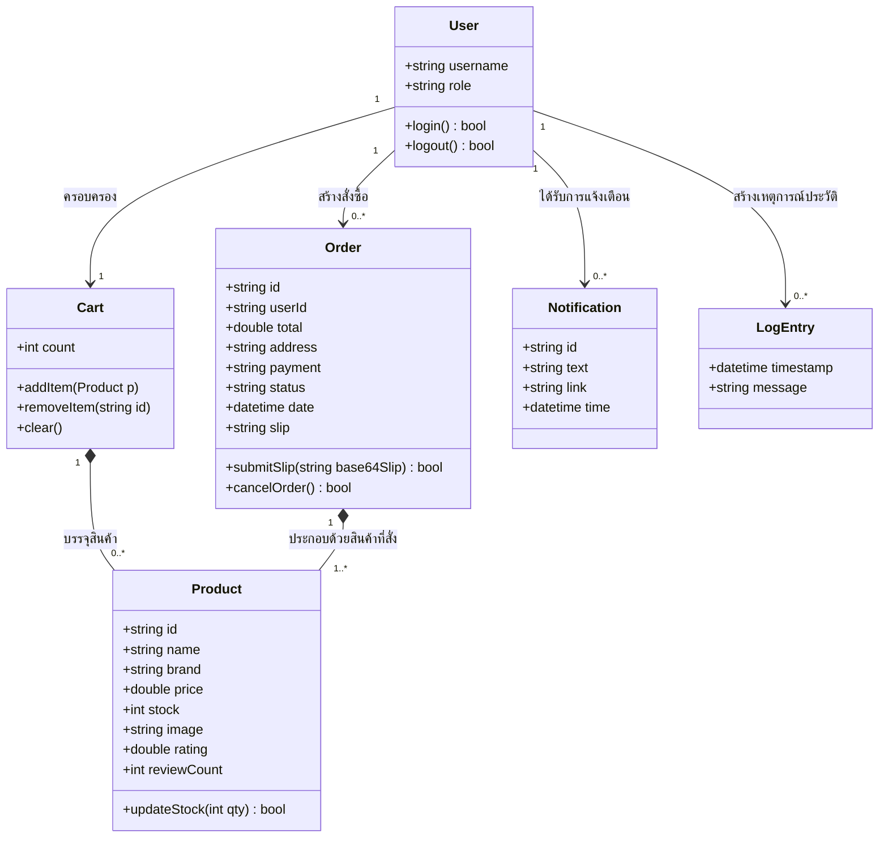

# 📄 รายงาน Workshop #2: การวิเคราะห์และออกแบบระบบด้วย UML Diagram
## กรณีศึกษา: ระบบแพลตฟอร์มร้านขายนาฬิกาหรูออนไลน์ (WatchMart)
**วิชา: CSI204 ดิจิทัลแพลตฟอร์มสำหรับพัฒนาซอฟต์แวร์ (SPU SIT)**

**ผู้จัดทำ:**
1. **กฤษฎา ต้องไกรเลิศ** (รหัสนักศึกษา: 67115444)
2. **ภูกิจ ปัญญาธิ** (รหัสนักศึกษา: 67120169)
3. **นนทิวัชร หมื่นสาย** (รหัสนักศึกษา : 67117362)

---

## 1. บทนำและการวิเคราะห์ความต้องการระบบ (System Requirements Analysis)
จากการวิเคราะห์ระบบ **WatchMart** ที่เป็นแพลตฟอร์มการซื้อขายนาฬิการะดับพรีเมียมออนไลน์ สามารถสรุปฟังก์ชันการทำงานและความต้องการตามแนวทางวงจรการพัฒนาซอฟต์แวร์ (SDLC) ได้ดังนี้:

### 1.1 ผู้เกี่ยวข้องในระบบ (Actors)
ในระบบมีผู้เกี่ยวข้องหลักทั้งหมด 3 กลุ่มหลัก (แบ่งออกเป็น 4 บทบาททางโครงสร้างสิทธิ์) ดังนี้:
1. **ผู้ซื้อ (Customer/User):** ลูกค้าทั่วไปที่เข้ามาเลือกซื้อสินค้า ทำการจอง ชำระเงิน และติดตามสถานะพัสดุ
2. **ผู้จัดการ (Manager):** รับผิดชอบการจัดการคลังสินค้า (สต็อกนาฬิกา), ตรวจสอบความถูกต้องของหลักฐานสลิปโอนเงินขั้นต้น และดำเนินการจัดส่งสินค้า
3. **ผู้ดูแลระบบ (Admin):** ผู้ตรวจสอบสิทธิ์สูงสุด มีหน้าที่อนุมัติการลงนาฬิกาเข้าคลัง, ทำการตรวจสอบแบล็คลิสต์พนักงานขาย, และเป็นผู้กด "ยืนยันการชำระเงินขั้นสุดท้าย (Final Confirm)" หลังจากผู้จัดการตรวจสอบสลิปผ่านแล้วเพื่อความปลอดภัยสูงสุดในการรับเงิน

### 1.2 ความต้องการเชิงฟังก์ชัน (Functional Requirements)
- **สิทธิ์การเข้าถึงแบบ Role-Based Access Control (RBAC):** มีระบบการกรองสิทธิ์ระหว่างแอดมิน, ผู้จัดการ และลูกค้าอย่างเข้มงวด
- **ระบบสั่งซื้อและชำระเงินแบบยืดหยุ่น (24-Hour Pay Later):** ลูกค้าสามารถกดสั่งซื้อนาฬิกาเพื่อตัดสต็อกไว้ก่อน (Hold Stock) โดยต้องทำการชำระเงินและแนบสลิปภายใน 24 ชั่วโมง มิฉะนั้นระบบจะยกเลิกออเดอร์โดยอัตโนมัติ
- **ระบบตรวจสอบสลิป 2 ขั้นตอน (2-Step Slip Verification):** 
  - ขั้นที่ 1: **ผู้จัดการ (Manager)** ตรวจสอบความถูกต้องของสลิปโอนเงิน (จาก `pending_review` เป็น `manager_approved`)
  - ขั้นที่ 2: **ผู้ดูแลระบบ (Admin)** ทำการกดยืนยันขั้นสุดท้าย (จาก `manager_approved` เป็น `confirmed`) เพื่อป้องกันพนักงานทุจริต
- **ระบบแจ้งเตือนแบบเรียลไทม์ (Real-time Notification Bar):** แจ้งเตือนลูกค้าและเจ้าหน้าที่เมื่อสถานะของสลิปหรือออเดอร์มีการเปลี่ยนแปลง

---

## 2. แผนภาพ Use Case (Use Case Diagram)
แผนภาพแสดงความสัมพันธ์ระหว่างผู้ใช้งาน (Actors) และฟังก์ชันการทำงาน (Use Cases) ภายใต้ขอบเขตของระบบ (System Boundary) ของ WatchMart:

```mermaid
graph TD
    %% Define Actors
    UserActor["👤 ผู้ซื้อ (Customer)"]
    ManagerActor["🛍️ ผู้จัดการ (Manager)"]
    AdminActor["👑 ผู้ดูแลระบบ (Admin)"]

    subgraph WatchMart_Boundary ["📦 ขอบเขตรองรับระบบ WatchMart Platform"]
        %% Common Use Cases
        UC_Login["เข้าสู่ระบบ (Login)"]
        
        %% Customer Use Cases
        UC_Browse["ค้นหาและชมนาฬิกาพร้อมคะแนนรีวิวดาว (Browse & Filter Watch)"]
        UC_Cart["จัดการตะกร้าสินค้า (Manage Cart)"]
        UC_Checkout["สั่งซื้อสินค้า (Checkout / Pay Later)"]
        UC_UploadSlip["แนบสลิปชำระเงินภายใน 24 ชม. (Upload Slip)"]
        UC_Track["ดูประวัติและติดตามออเดอร์ (View Orders History)"]
        UC_Notif["รับการแจ้งเตือนสถานะออเดอร์ (Receive Notification)"]

        %% Manager Use Cases
        UC_ManageStock["จัดการคลังนาฬิกา (Manage Watch Catalog)"]
        UC_VerifySlip["ตรวจสอบสลิปโอนเงินขั้นต้น (Verify Slip)"]
        UC_Ship["ดำเนินการจัดส่งสินค้า (Ship Order)"]

        %% Admin Use Cases
        UC_ApproveWatch["อนุมัตินำนาฬิกาเข้าขาย (Approve Watch Catalog)"]
        UC_FinalConfirm["ยืนยันออเดอร์ขั้นสุดท้าย (Final Confirm Order)"]
        UC_Audit["ตรวจสอบราคากลางและประวัติระบบ (Audit Logs)"]
    end

    %% Customer Connections
    UserActor --> UC_Login
    UserActor --> UC_Browse
    UserActor --> UC_Cart
    UserActor --> UC_Checkout
    UserActor --> UC_UploadSlip
    UserActor --> UC_Track
    UserActor --> UC_Notif

    %% Manager Connections
    ManagerActor --> UC_Login
    ManagerActor --> UC_ManageStock
    ManagerActor --> UC_VerifySlip
    ManagerActor --> UC_Ship

    %% Admin Connections
    AdminActor --> UC_Login
    AdminActor --> UC_ApproveWatch
    AdminActor --> UC_FinalConfirm
    AdminActor --> UC_Audit

    %% Include Relations
    UC_Checkout -.->|"<<include>>"| UC_Login
    UC_UploadSlip -.->|"<<include>>"| UC_Login
    UC_VerifySlip -.->|"<<include>>"| UC_Login
    UC_FinalConfirm -.->|"<<include>>"| UC_Login
```

---

## 3. แผนภาพคลาส (Class Diagram)
แผนภาพแสดงโครงสร้างข้อมูล ความสัมพันธ์ระหว่างอ็อบเจกต์ (Associations) และเมธอดการทำงานหลักของระบบ WatchMart:

---

## 4. สรุปความเชื่อมโยงกับสถาปัตยกรรมโค้ดจริง (System Implementation Traceability)
1. **คลาส User:** ตรงกับโครงสร้างโมเดล `User` ใน [database.ts](file:///c:/Users/gusbo/OneDrive/Desktop/Workshop1/backend/src/database.ts) และสิทธิ์การเข้าใช้งานที่ตรวจผ่านระบบ Router Guard (`RequireRole`) ใน [App.jsx](file:///c:/Users/gusbo/OneDrive/Desktop/Workshop1/frontend/src/App.jsx).
2. **การทำงานของออเดอร์ (Order & Slip Flow):** ฟังก์ชัน `submitSlip` และสถานะการชำระเงินสอดคล้องกับคลาส `Order` ของฐานข้อมูลจริง รองรับการคำนวณเวลาถอยหลัง 24 ชั่วโมงก่อนหมดสิทธิ์โอนเงิน
3. **ระบบแจ้งเตือน (Notification):** แสดงในคอมโพเนนต์ Header (`Header.jsx`) โดยมีการกวาดข้อมูลจากฐานข้อมูลออเดอร์มาคำนวณสถานะแจ้งเตือนในรูปแบบเรียลไทม์
